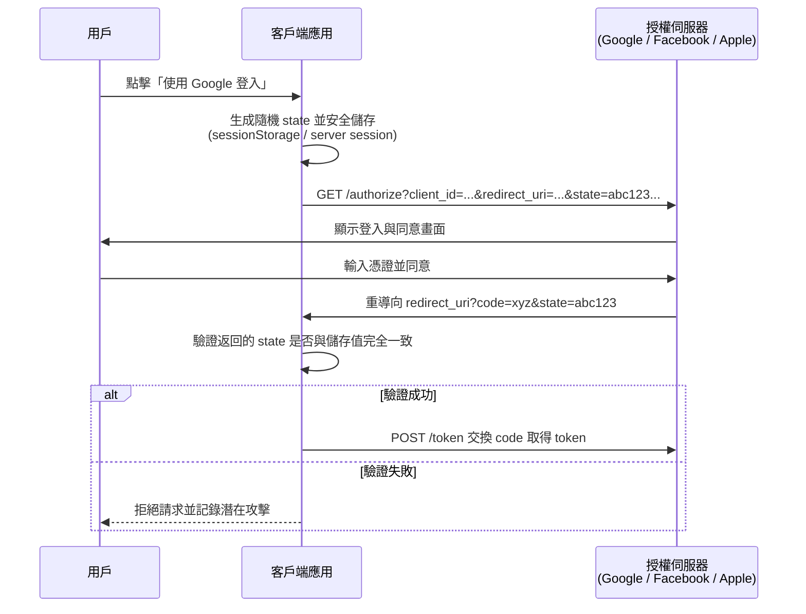
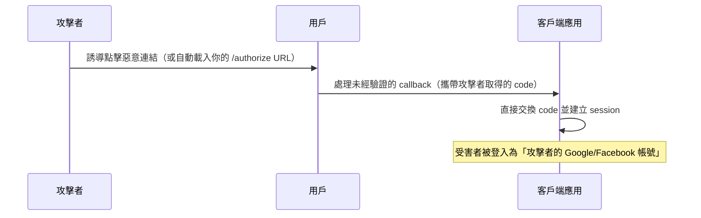
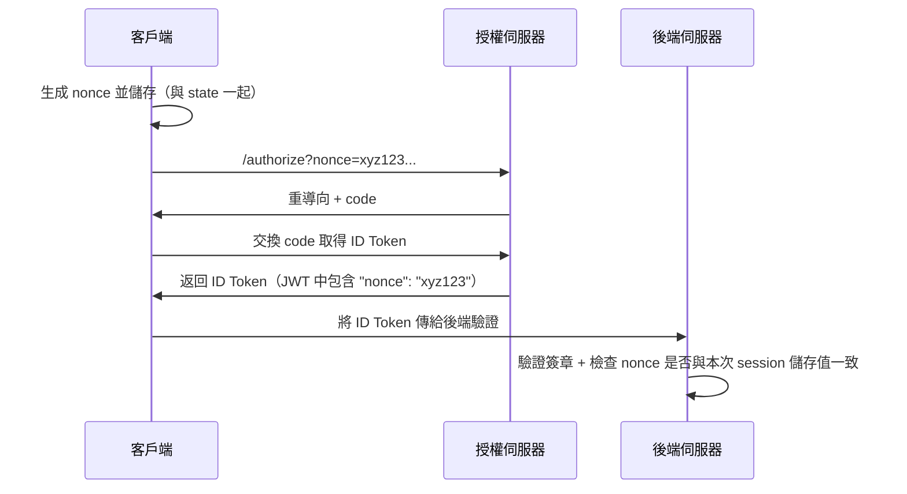

在現代網頁與行動應用程式中，整合第三方登入（如 Google、Facebook、Sign In with Apple，簡稱 SIWA）已是標準功能。這些功能基於 **OAuth 2.0** 協議，並常搭配 **OpenID Connect (OIDC)** 擴展來取得使用者身份資訊。然而，開發者在實作時最常忽略的資安關鍵，正是 **state** 與 **nonce** 兩個參數的正確生成、傳遞與驗證。

<!--more-->

本文將詳細說明這兩個參數的作用，以及在缺乏驗證時會引發的嚴重安全問題。無論你是前端工程師、後端開發者，或正在整合 Google / Facebook / SIWA 的開發團隊，本文都能幫助你徹底掌握這些機制，避免常見資安漏洞。

## 1. state 參數的作用與運作機制

**state** 是 OAuth 2.0 標準（RFC 6749）中用來**防止跨站請求偽造 (Cross-Site Request Forgery, CSRF)** 的核心參數。它是一個由客戶端（你的應用程式）生成的**隨機、不透明、不可猜測**的字串，用來將「授權請求」與「授權回應」嚴格綁定。

### state 的主要功能
- 防止 CSRF 攻擊
- 恢復應用程式原始狀態（例如登入後要跳轉的頁面）
- 確保回應確實來自你自己發起的請求

### 標準運作流程（以 Authorization Code Flow 為例）



### 若缺乏 state 驗證，會發生什麼問題？

沒有 state 驗證時，攻擊者可輕易發動 login CSRF 或 authorization code injection 攻擊：



### 具體危害：

- 受害者帳號被綁定攻擊者的第三方身份
- 攻擊者可存取受害者在你應用中的敏感資料
- 可能導致帳號接管、未經授權轉帳、資料外洩等嚴重後果

Auth0、Google 官方文件與 OWASP 均強烈建議必須驗證 state。

## 2. nonce 參數的作用與運作機制

**nonce**（number used once，一次性數值）主要用於 OpenID Connect，目的是防止 ID Token 的重放攻擊 (Replay Attack)。

ID Token 是由授權伺服器簽章的 JWT，包含 sub（使用者唯一識別）、exp、iat 等欄位。若沒有 nonce，攻擊者即使無法偽造簽章，仍可重用先前截取的有效 ID Token。

### nonce 的運作流程



### 若缺乏 nonce 驗證，會發生什麼問題？

攻擊者可從瀏覽器歷史、網路記錄、或先前 session 中取得有效 ID Token，然後直接重放給你的應用：

- 你的應用只驗證 JWT 簽章與到期時間 → 接受舊 token
- 攻擊者成功以受害者身份登入
- 尤其在 Implicit Flow 或混合流中風險更高

Apple 官方文件特別強調：nonce 必須在伺服器端驗證，以防止重放。

## 3. 在 Google、Facebook 與 SIWA 中的實際應用

| 提供者 | state 使用情境 | nonce 使用情境 | 官方建議 |
|---|---|---|---|
| Google | OAuth2 / OIDC 均建議使用，用於防止 CSRF 並恢復原始狀態 | OIDC 必須在驗證 ID Token 時檢查 nonce（防重放） | 必須驗證 state；對 OIDC 必須驗證 nonce |
| Facebook | OAuth2 登入必須使用 state（防 CSRF、綁定請求） | Facebook 不提供完整 OIDC，無標準 nonce（若自行實作需額外驗證） | 必須使用 state；nonce 無標準支援，視情況自行設計驗證 |
| SIWA (Sign In with Apple) | 客戶端需檢查回傳的 state（防 CSRF、恢復跳轉） | 伺服器端需驗證 ID Token 中的 nonce（防重放） | 兩者皆必須：客戶端驗證 state，後端驗證 JWT 的 nonce |

**SIWA 特別注意**：Apple 會在回應中同時返回 state 與包含 nonce 的 identityToken。開發者需在客戶端檢查 state，在後端使用 jsonwebtoken 或 Apple 公鑰驗證 nonce。

## 4. TypeScript 偽碼範例（前端 SPA）

以下範例適用於 React / Next.js / Vue 等單頁應用，使用 Web Crypto API 生成高熵隨機值。

### 生成與啟動登入

```typescript
// utils/oauth.ts
function generateSecureRandom(length = 32): string {
  const array = new Uint8Array(length);
  crypto.getRandomValues(array);
  return Array.from(array, (b) => b.toString(16).padStart(2, '0')).join('');
}

export async function startOAuthLogin(
  provider: 'google' | 'facebook' | 'apple',
  redirectAfterLogin?: string
) {
  const state = generateSecureRandom();
  const nonce = provider !== 'facebook' ? generateSecureRandom() : undefined;

  // 儲存（SPA 推薦 sessionStorage；生產環境建議後端 signed cookie）
  sessionStorage.setItem('oauth_state', state);
  if (nonce) sessionStorage.setItem('oauth_nonce', nonce);

  // 可額外把 redirectAfterLogin 加密後放入 state（Base64 + HMAC）
  const finalState = redirectAfterLogin 
    ? `${state}|${btoa(redirectAfterLogin)}` 
    : state;

  const params = new URLSearchParams({
    client_id: import.meta.env.VITE_CLIENT_ID,
    redirect_uri: `${location.origin}/auth/callback`,
    response_type: 'code',
    scope: provider === 'facebook' ? 'email' : 'openid email profile',
    state: finalState,
    ...(nonce && { nonce }),
    // PKCE 推薦參數
    code_challenge: await generateCodeChallenge(),
    code_challenge_method: 'S256',
  });

  const baseUrl = {
    google: 'https://accounts.google.com/o/oauth2/v2/auth',
    facebook: 'https://www.facebook.com/v20.0/dialog/oauth',
    apple: 'https://appleid.apple.com/auth/authorize',
  }[provider];

  window.location.href = `${baseUrl}?${params.toString()}`;
}
```

### 回調頁面驗證

```typescript
// pages/auth/callback.tsx
export default function OAuthCallback() {
  useEffect(() => {
    const params = new URLSearchParams(window.location.search);
    const returnedState = params.get('state');
    const code = params.get('code');
    const error = params.get('error');

    if (error) {
      console.error('OAuth 錯誤:', error);
      return;
    }

    const storedState = sessionStorage.getItem('oauth_state');
    if (!returnedState || !storedState || returnedState.split('|')[0] !== storedState) {
      console.error('Invalid state: 可能遭受 CSRF 攻擊！');
      // 可導向錯誤頁面或登出
      return;
    }

    // 清空儲存
    sessionStorage.removeItem('oauth_state');
    sessionStorage.removeItem('oauth_nonce');

    // 呼叫後端 API 交換 code（避免 client secret 洩漏）
    exchangeCodeForTokens(code!, provider);
  }, []);

  return <div>驗證中，請稍候...</div>;
}
```

後端驗證 nonce 範例（Node.js / NestJS 偽碼）：

```typescript
const jwt = require('jsonwebtoken');
const { getPublicKey } = require('./apple-public-key'); // 或 Google JWKS

async function verifyIdToken(idToken: string, storedNonce: string) {
  const decoded = jwt.decode(idToken) as any;
  if (decoded.nonce !== storedNonce) {
    throw new Error('Nonce 不匹配：重放攻擊！');
  }
  // 繼續驗證簽章、issuer、audience、exp 等
}
```

## 5. 最佳實踐與常見錯誤

- 隨機值生成：永遠使用 crypto.getRandomValues()，長度至少 32 位元組（256-bit 熵）。
- 儲存方式：SPA 用 sessionStorage；傳統網頁用 server-side session 或 HttpOnly + SameSite=Strict Cookie。
- 驗證時機：state 在前端 callback 立即檢查；nonce 在後端 ID Token 驗證時檢查。
- 清除機制：驗證成功或失敗後立即移除。
- 常見錯誤：
  - 使用 Math.random() 生成 state/nonce
  - 把 state 存在 localStorage（跨 tab 持久化）
  - 只在開發環境驗證，上線後移除
  - 未使用 PKCE（對 public client 極危險）

## 結論

state 守護授權流程的完整性，nonce 守護 ID Token 的新鮮度。兩者缺一不可，是整合 Google、Facebook、SIWA 時最關鍵的資安防線。

正確實作這兩個參數，能大幅降低 CSRF、重放攻擊風險，讓你的應用符合 OAuth 2.0 / OIDC 規範與各大提供者的安全審核要求。

建議開發團隊將這些邏輯封裝成可重用的 Hook / Middleware，並搭配成熟 SDK（如 `@auth0/auth0-spa-js`、`next-auth`）加速開發。

希望本文能幫助你在實務專案中建立更安全的第三方登入系統 🙂
